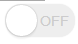

#form表单那点事儿(上) 基础篇

做为html中最为常见，应用最广泛的标签之一，form常伴随前端左右。了解更深，用的更顺。

目录：

[表单属性](#props)

[表单元素](#elements)

* [常识](#general)

* [模拟外观](#skin)


<a name='props'></a>
##表单属性
这个表单展示了form表单常用的属性

<table width=100%>
    <thead>
        <th width=100>属性名</th>
        <th width=230>属性值</th>
        <th>描述</th>
    </thead>
    <tr>
        <td>action</td>
        <td> 一个url地址</td>
        <td> 指定表单提交到的地址 </td>
    </tr>
    <tr>
        <td>method</td>
        <td>`GET` , `POST`</td>
        <td>表单将以此种方法提交到服务器</td>
    </tr>
    <tr>
        <td>target</td>
        <td>
        <p> `_self` 当前页面</p>
        <p> `_blank` 每次在新窗口打开</p>
        <p> `blank`  每次在同一个新窗口打开</p>
        <p> `_parent` 父级frame</p>
        <p> `_top` 顶级frame</p>
        <p> iframename 指定的iframe</p>
        </td>
        <td>表单提交后，收到回复的页面</td>
    </tr>
    <tr>
        <td>name</td>
        <td>-</td>
        <td>一个html文档中，每个form的name应该是唯一的</td>
    </tr>
    <tr>
        <td>enctype</td>
        <td>
        <p> `application/x-www-form-urlencoded` 默认值</p>
        <p> `multipart/form-data` 上传file用</p>
        <p> `text/plain` html5默认</p>
        </td>
        <td>
            以 `POST` 方式提交form时的MIME类型。文件上传必须使用 `multipart/form-data`
        </td>
    </tr>
    <tr>
        <td>autocomplete</td>
        <td>`on` , `off`</td>
        <td>是否自动完成表单字段</td>
    </tr>
    <tr>
        <td>autocapitalize</td>
        <td>
        <p> `none` 完全禁用自动首字母大写</p>
        <p> `sentences` 自动对每句话首字母大写</p>
        <p> `words` 自动对每个单词首字母大写 </p>
        <p> `characters` 自动大写所有的字母</p>
        </td>
        <td>
             iOS 专用属性，表单中文本域英文大小写
        </td>
    </tr>
    <tr>
        <td>accept-charset</td>
        <td>字符编码格式( `utf-8` , `gb-2312` 等)</td>
        <td>
            将会以此种编码格式提交表单到服务器，默认值是UNKONWN，即html文档所采用的编码格式。
        </td>
    </tr>
    <tr>
        <td>novalidate</td>
        <td>`true` , `false`</td>
        <td>
            是否启用表单校验
        </td>
    </tr>
    <tr>
        <td colspan=3></td>
    </tr>
</table>

下面举例的表单将会以 `post` 方式将input的值以 `utf-8` 编码格式提交到 `/login` 接口，并会打开一个新页面显示返回结果，由于 `target="blank"` ，所以就算提交多次该表单，都只会继续刷新之前打开的窗口。
````html
<!DOCTYPE html>
<html lang="en">
<head>
  <meta charset="UTF-8">
</head>
<body>
  <form action="/login" method="post" target="blank" >
    <input type="text" name='username'>
    <button>提交</button>
  </form>
</body>
</html>
````

<a name='elements'></a>
##表单元素

常见的表单元素包括 `input` , `select` , `textarea` , `button` , `progress` 等，这些元素都有一些自己的属性

<table width=100%>
    <thead>
        <th width=100>属性名</th>
        <th width=230>属性值</th>
        <th>描述</th>
    </thead>
    <tr> <td colspan=3 bgcolor='#eee'><strong>必须</strong></td></tr>
    <tr>
        <td>type</td>
        <td>
        <p> `text` 单行文本框</p>
        <p> `raido` 单选框</p>
        <p> `checkbox` 多选框</p>
        <p> `tel` 电话号码输入框</p>
        <p> `range` 滑块取值框</p>
        ... ... 更多
        </td>
        <td>指定input标签展示的样式，忽略type属性将默认使用 `text`</td>
    </tr>
    <tr>
        <td>name</td>
        <td>字符串</td>
        <td>form提交时，该字段的key，忽略value属性的元素将不会被提交</td>
    </tr>
    <tr><td colspan=3 bgcolor='#eee'><strong>状态</strong></td></tr>
    <tr>
        <td>checked</td>
        <td>任意值 或 忽略该属性</td>
        <td>有此属性的radio和checkbox元素将被选中，同一name多个元素具有此属性的，提交时取最后一个值</td>
    </tr>
    <tr>
        <td>selected</td>
        <td>任意值 或 忽略该属性</td>
        <td>有此属性的option元素将被选中，同一name多个元素具有此属性的，提交时取最后一个值</td>
    </tr>
    <tr>
        <td>readonly</td>
        <td>任意值 或 忽略该属性</td>
        <td>具有该属性的表单元素将不可输入或改变状态，除非用JavaScript操作</td>
    </tr>
    <tr>
        <td>disabled</td>
        <td>任意值 或 忽略该属性</td>
        <td>除拥有readonly的特征外，表单提交时，将忽略此字段</td>
    </tr>
    <tr><td colspan=3 bgcolor='#eee'><strong>限制</strong></td></tr>
    <tr>
        <td>form</td>
        <td>表单id</td>
        <td>该元素将作为指定id表单字段被提交。用于 `button` 或 `input type='submit'` 元素时，将提交指定id的表单 <a href='#form'>示例代码</a></td>
    </tr>
    <tr>
        <td>accept</td>
        <td>
        <p> `image/*` 只能上传图片</p>
        <p> `video/*` 只能上传视频</p>
        </td>
        <td>
          `input type='file'` 使用的属性，是一个MIME类型的值，或文件后缀名。 <a href='#accept'>示例代码</a>
        </td>
    </tr>
    <tr>
        <td>multiple</td>
        <td>
          任意值 或 忽略该属性
        </td>
        <td>
        `input type='file'` 或 `select` 或 应用了 `datalist` 的表单元素才能应用该属性<a href='#multiple'>示例代码</a>
        </td>
    </tr>
    <tr>
        <td>maxlength</td>
        <td>
          正整数或0
        </td>
        <td>
          文本域可输入字符的长度，浮点数将会向下取整，负数将被忽略，JavaScript可以绕过这一限制
        </td>
    </tr>
    <tr>
        <td>required</td>
        <td>任意值 或 忽略该属性</td>
        <td>该表单字段是否需要被验证</td>
    </tr>
    <tr>
        <td>pattern</td>
        <td>一个正则表达式</td>
        <td> `\d{4,6}` 形式的正则表达式，作为required校验规则</td>
    </tr>
    <tr>
        <td>autocomplete</td>
        <td>
        `on` , `off`
        </td>
        <td>同form的autocomplete属性，在表单元素上应用，优先级将高于form上指定的</td>
    </tr>
    <tr>
        <td>autofocus</td>
        <td>
        任意值 或 忽略该属性
        </td>
        <td>页面加载时，该元素自动聚焦，应用于多个表单元素时，聚焦到第一个</td>
    </tr>
    <tr><td colspan=3 bgcolor='#eee'><strong>展示</strong></td></tr>
    <tr>
        <td>placeholder</td>
        <td>
        字符串
        </td>
        <td>在元素没有value时，用于占位显示</td>
    </tr>
    <tr>
        <td>value</td>
        <td>
        字符串 或 数值
        </td>
        <td>
          input 或 progress 展示的值,其中：
          checkbox和radio的默认值是 'on' <br>
          range和progress的默认值是 0 <br>
          progress的是0的时候会播放循环动画 <br>
          <a href='#value'>示例代码</a>
        </td>
    </tr>
</table>

**注意：以下示例部分来自 [w3.org](https://www.w3.org/TR/html5/forms.html#attr-input-multiple)**

<a name='form'></a>
>form示例

>点击预览按钮，将会把 username1 的值提交到 /preview，
 
>点击发布按钮，将会把 username 的值提交给 /publish
<form action="/preview" name='preview' id='preview'></form>
<form action="/publish" name='publish' id='publish'>
  <input type="text" name='username' value='1'>
  <input type="text" form='preview' name='username1' value='2'>
  <button form='preview'>预览</button>
  <button>发布</button>
</form>

````html
<form action="/preview" name='preview' id='preview'></form>

<form action="/publish" name='publish' id='publish'>
  <input type="text" name='username' value='1'>
  <input type="text" form='preview' name='username1' value='2'>
  <button form='preview'>预览</button>
  <button>发布</button>
</form>

````

<a name='accept'></a>
>accept示例
<input type="file" accept=".doc,.docx,.xml,application/msword,application/vnd.openxmlformats-officedocument.wordprocessingml.document">
````html
<input type="file" accept=".doc,.docx,.xml,application/msword,application/vnd.openxmlformats-officedocument.wordprocessingml.document">
````

<a name='multiple'></a>
multiple示例

>需要键入 ',' 方可多选(需浏览器支持)
<label>Cc: <input type=email multiple name=cc list=contacts></label>
<datalist id="contacts">
 <option value="hedral@damowmow.com">
 <option value="pillar@example.com">
 <option value="astrophy@cute.example">
 <option value="astronomy@science.example.org">
</datalist>
````html
<label>Cc: <input type=email multiple name=cc list=contacts></label>
<datalist id="contacts">
 <option value="hedral@damowmow.com">
 <option value="pillar@example.com">
 <option value="astrophy@cute.example">
 <option value="astronomy@science.example.org">
</datalist>
````

.
>需要一直按下ctrl键才可多选
<select name='number' multiple>
  <option value="CN">中国</option>
  <option value="US">美国</option>
  <option value="UK">英国</option>
</select>
````html
<select name='number' multiple>
  <option value="CN">中国</option>
  <option value="US">美国</option>
  <option value="UK">英国</option>
</select>
````

.
>直接框选多文件即可
<input type="file" multiple>
````html
<input type="file" multiple>
````


<a name='value'></a>
>value示例
<progress value='70' max='100'></progress>
<input type="range" value='40' max='100'>
<input type="text" value='hello world'>
````html
<progress value='70' max='100'></progress>
<input type="range" value='40' max='100'>
<input type="text" value='hello world'>
````


<a name='general'></a>
###常识
下面是对于上面表格的一些总结，也加入了一些新的知识点
* 没有 `name` 和有 `disable` 的字段不会被提交
* 同一个表单中，相同name的字段值会发生覆盖，`radio` 和 `checkbox` 除外
* 在低版本浏览器中，name可以作为id使用
* 忽略或使用浏览器不支持的 `type` 会转为 `type=text`
* 低版本浏览器不支持动态改变 `type`
* 点击 `button` 会默认提交表单
* 低版本浏览器需要指定 `button` 的 `type=submit` 才会提交表单
* 文本域的光标颜色由字体颜色决定
* **form表单不能互相嵌套**
* **表单元素可以不在表单的html结构内** [示例代码](#form)
* **在表单最后一个input元素中敲回车，会触发表单提交** 


<a name='skin'></a>
###模拟外观

有一千种浏览器，就有一千种表单元素外观。在以前，要想改变表单元素外观，需要通过其他标签来模拟。
而在现代浏览器上，通过css3的`appearance`属性( [兼容情况](http://caniuse.com/#search=-webkit-appearance) )指定元素的渲染风格，
再结合`:after`,`:before`伪元素，可以做出很酷炫的表单元素外观。

作为可替换元素，input标签无法使用伪元素。当然这只是W3标准。以下点到名的表单元素，还是可以照常使用`:after`,`:before`的。

`input type='radio'` , `input type='checkbox'` , `input type='file'` , `input type='range'` , `button` , `progress`.

`appearance`是css3的标准属性，面对现实，很多时候还是需要加上`-webkit-` ，`-moz-` 前缀，举一个把checkbox做成开关的例子：

````html
<style>
    input[type='checkbox'] {
        -webkit-appearance: none;
        padding: 9px;
        border-radius: 50px;
        display: inline-block;
        position: relative;
        outline: 0;
        -webkit-transition: all 0.1s ease-in;
        transition: all 0.1s ease-in;
        width: 70px;
        height: 33px;
    }
    
    input[type='checkbox']:before,
    input[type='checkbox']:after {
        position: absolute;
        content: '';
        border-radius: 100px;
        -webkit-transition: all 0.1s ease-in;
        transition: all 0.1s ease-in;
    }
    
    input[type='checkbox']:before {
        background: white;
        top: 1px;
        left: 1px;
        z-index: 2;
        width: 31px;
        height: 31px;
        box-shadow: 0 3px 1px rgba(0, 0, 0, 0.05), 0 0px 1px rgba(0, 0, 0, 0.3);
    }
    
    input[type='checkbox']:after {
        content: 'OFF';
        top: 0;
        left: 0;
        width: 100%;
        height: 100%;
        box-shadow: inset 0 0 0 0 #eee, 0 0 1px rgba(0, 0, 0, 0.4);
        line-height: 34px;
        font-size: 14px;
        background: #eee;
        color: #ccc;
        text-indent: 35px;
        box-sizing: border-box;
        box-shadow: 0 0 1px #eee;
    }
    
    input[type='checkbox']:checked:before {
        left: 37px;
    }
    
    input[type='checkbox']:checked:after {
        content: 'ON';
        color: #fff;
        text-indent: 10px;
        background: #4cda60;
    }
</style>
<input type="checkbox">
````

不出意外，长成这样  ,


**示例代码来自**[10个HTML5美化版复选框和单选框](http://www.html5tricks.com/10-pretty-checkbox-radiobox.html)

<a name='handle'></a>


#### 参考资料
[MDN](https://developer.mozilla.org/zh-CN/docs/Web/HTML/Element/form)

[w3.org](https://www.w3.org/TR/html5/forms.html)


